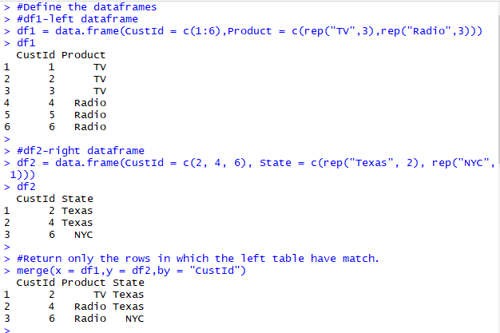
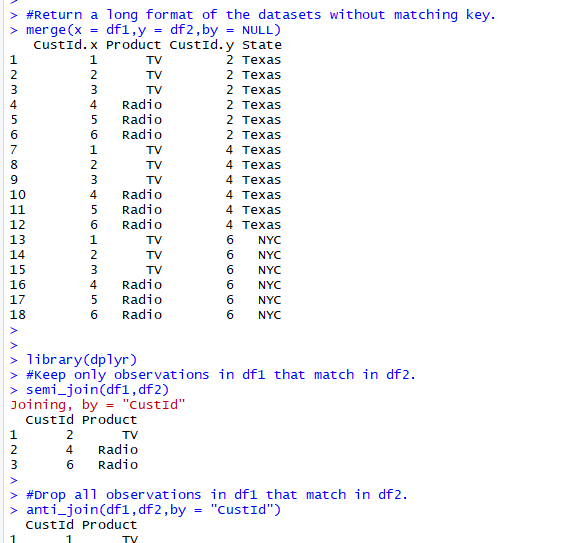
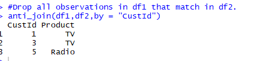

df1 = data.frame(CustId = c(1:6), Product = c(rep("TV", 3), rep("Radio", 3)))
df2 = data.frame(CustId = c(2, 4, 6), State = c(rep("Texas", 2), rep("NYC", 1)))
df1 #left table
df2 #right table
For the above given data frames and tables perform the following operations:
• Return only the rows in which the left table have match.
• Returns all rows from both tables, join records from the left which have matching keys
in the right table.
• Return all rows from the left table, and any rows with matching keys from the right
table.
• Return all rows from the right table, and any rows with matching keys from the left
table.

code:

solution:

